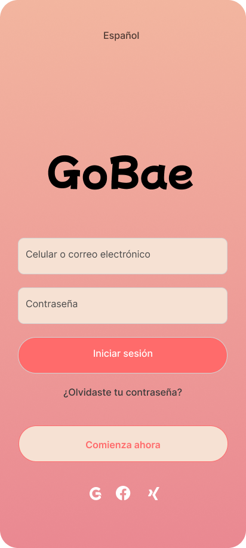
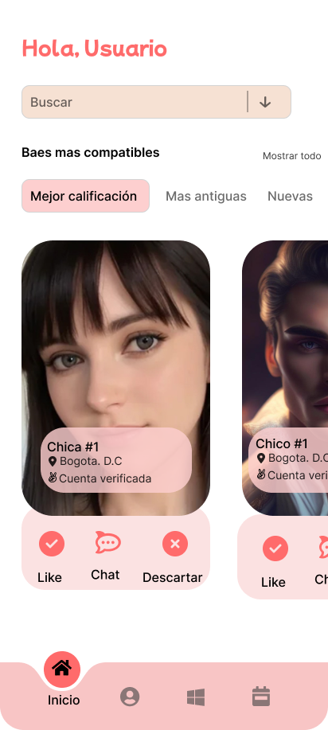
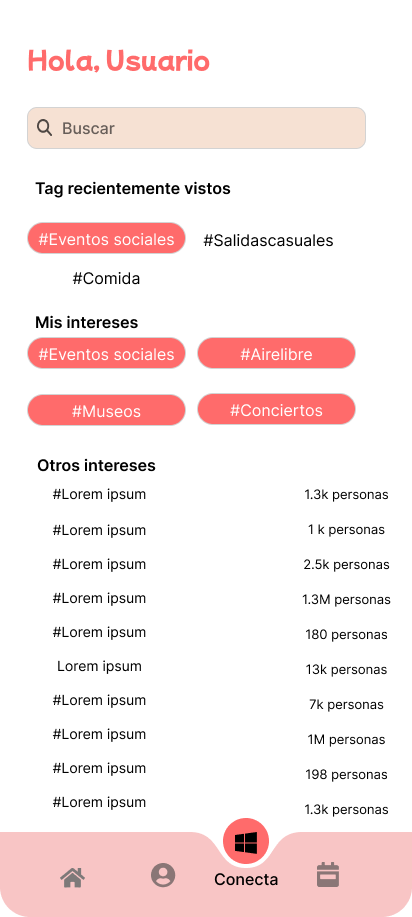
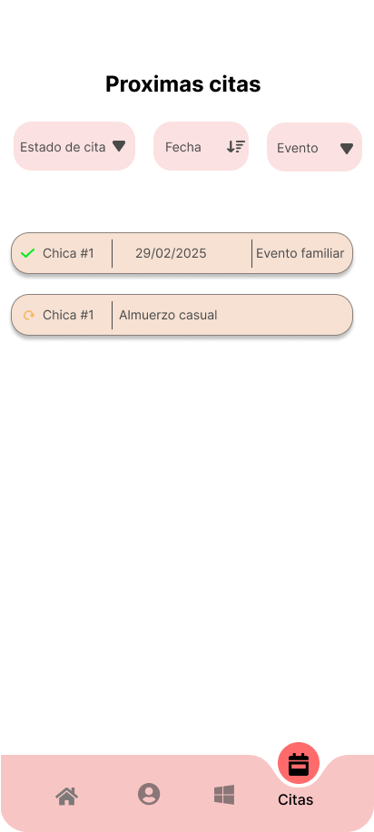
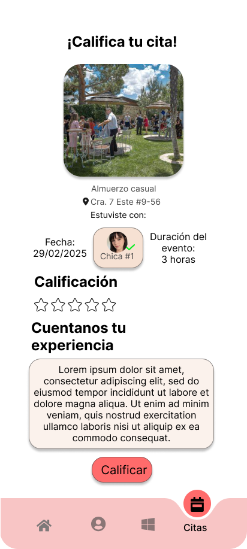
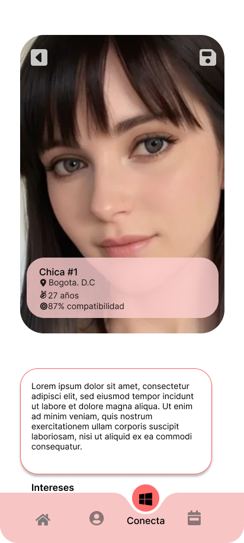
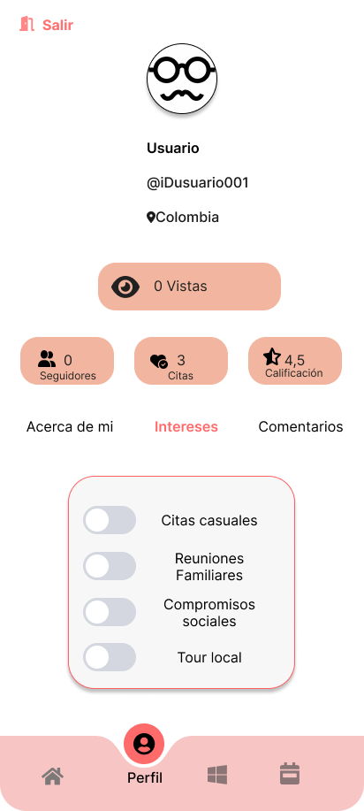
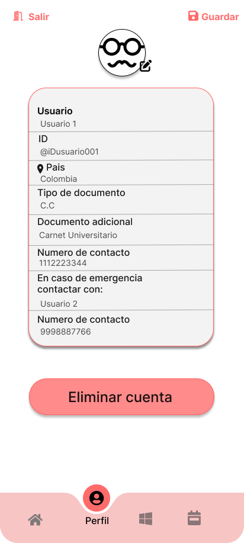

# Diseño de interfaz de usuario

La aplicación tendrá la siguientes pantallas

1. Login: Mediante esta pantalla el usuario puede realizar el ingreso al aplicativo, permitiendo ingresar con un numero de telefono o correo previamente registrados, o si no mediante google, facebook o X, si no se puede hacer clic en el boton de comienza ahora para hacer registro de datos.

2. Vista principal: Una vez se ingresa al aplicativo, se muestra la pagina principal mediante la cual se pueden ver los perfiles de las personas compatibles con base en las preferencias del perfil, ademas de ofrecer filtros como el de mejor calificado, mas antiguas usando la app o cuentas recien creadas, ofrece un buscador mediante el cual se pueden buscar cuentas compatibles con base a ciertas palabaras clave y se puede agregar a la persona mediante un like, se puede chatear con la persona o se puede descartar.

3. Busqueda: Al hacer clic en el cuadro de busqueda en la pagina principal o mediante la tercera opción de izquierda a derecha, se pueden ver los tipos de busqueda realizados, los que tenemos en nuestro perfil y un listado con los tipos de busqueda permitidos.

4. Citas: Cuando se hace un match con la persona y se propone una cita esta tiene un plazo para aceptarla de acuerdo al tipo de propuesta y tiempo de reunion, por lo que en el icono de calendario se pueden consultar las proximas citas disponibles, ademas de si estas fueron aceptadas o estan en proceso de aceptación, de manera general se muestra la persona con la que se busca tener la cita, la fecha y tipo de evento, ademas hay filtros de busqueda entre los que destacan el estado de cita, el orden de la fecha, siendo ascendente o descendente y el tipo de evento.

5. Calificación: Una vez se finlaiza la cita se muestra una opción para calificar la misma, en esta vista se muestra el tipo de evento al que se asistio, el lugar, la persona, la fecha y la duración de la cita, el sistema de calificación es de 5 estrellas siendo la calificación una escala de 0 a 5 pudiendo variar mediante media estrella, estrella vacia o completa, ademas de que ofrece un cuadro de texto mediante el cual se pueden contar datos adicionales de la cita para guiar a usuarios futuros.

6. Perfil de usuario: Si se quiere conocer mas sobre un usario al hacer clic en su imagen se mostrara nas detalladamente la información publica de la persona, el porcentaje de compatibilidad, edad y ciudad de residencia, permitiendo dar like ahi mismo o dando la opción de regresar.

7. Intereses: Al hacer clic en el icono del perfil se mostrara la información relevante de la cuenta, como el numero de seguidores o usuarios que dan like al perfil, el numero de visitas, el numero de citas con la cuenta y la calificación, si se desean ajustar los intereses para un aspecto en particular se hace dando clic en el apartado de intereses, en donde se pueden editar los intereses del perfil.

8. Editar información: Si se quiere actualizar o corregir la información presentada en el perfil esto se logra haciendo clic en la parte superior derecha en el icono del lapiz, mostrando la información registrada y permitiendo editarla, si por otro lado se desea eliminar la cuenta esta un boton en la parte inferior del formulario el cual borrara toda la información del usuario asociada y lo regresara a la vista de registro de usuario.

# Link de Figma para ver el mockup completo: 
 (https://www.figma.com/proto/xu177Gxh4g1Pr3N2B7Mmpq/GoBae?node-id=1-3&starting-point-node-id=1%3A3&t=IpjaWCV9CvamSyCV-1)
 
# Referencias

- [Material Design: Foundations](https://m3.material.io/foundations)
- [Material Design: Style](https://m3.material.io/styles)
